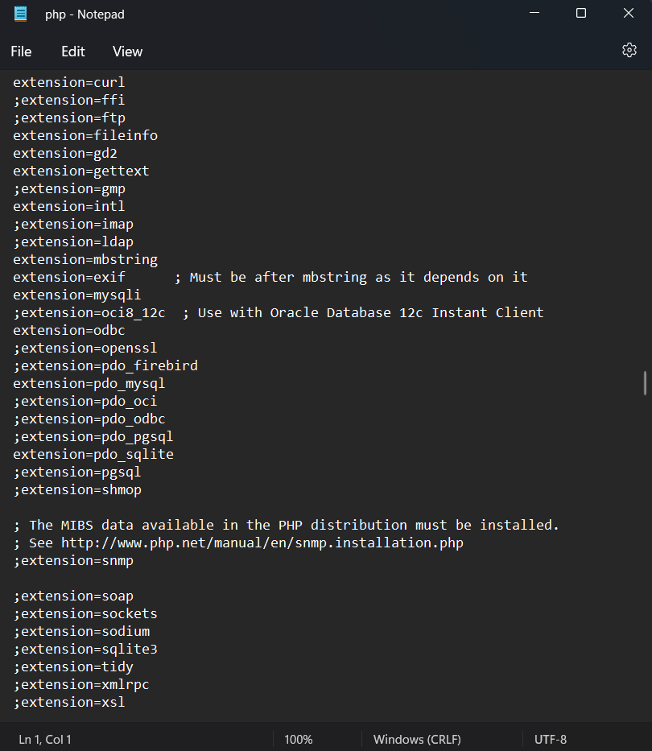

# PEMOGRAMAAN WEB

Diyan Arum Maheswari (312010133)

Teknik Informatika - UNIVERSITAS PELITA BANGSA
______________________________________________

# PRAKTIKUM 11

## MEMBUAT FOLDER BARU

Pertama, buatlah folder baru dengan nama Lab11_php_ci pada root directory web server(c:xampp/htdocs/Lab11Web)

Kemudian, sebelum memulai menggunakan Framework Codeigniter kita perlu melakukan konfigurasi dan juga mengaktifkan beberapa ekstentsi PHP seperti php-jose, php-mysqlnd, php-mxl, php-intl, dan libcurl.

## PENGAKTIFAN EKSTENTSI DENGAN XAMPP CONTROL PANEL

Untuk dapat mengaktifkannya kalian perlu masuk kedalam control panel xampp kemudian pada bagian apache klik Config > PHP.ini seperti gambar dibawah.


Setelahnya cukup hilangkan tanda ; pada ekstentsi yang akan diaktifkan seperti gambar dibawah. Kemudian simpan kembali file tersebut dan restart Apache web servernya.



## PENGINSTALLAN CODEIGNITER 4

Lakukan download pada codeigniter 4 dengan menggunakan website https://codeigniter.com/download


Pilih codeigniter 4 kemudian tekan download dan tunggu hingga terinstall.

## PROSES MENJALANKAN CLI (COMMAND LINE INTERFACE)

Codeigniter 4 menyediakan CLI untuk dapat mempermudah proses development. Untuk mengakses CLI bukalah terminal/command prompt. Kemudian arahkan lokasi direktori sesuai dengan direktori kerja project dibuat. (xampp/htdocs/Lab11Web/Lab11_php_ci/ci4)


Dan masukan perintah dibawah untuk dapat menjalankan guna memanggil CLI Codeigniter.

```php
php spark
```

## PENGAKTIFAN MODE DEBUGGING

Codeigniter 4 menyediakan fitur debugging untuk memudahkan developer untuk mengetahui pesan error apabila terjadi kesalahan dalam membuat kode program. Secara default fitur ini belum aktif. 

Maka untuk mengaktifkannya, Pertama ubahlah file env menjadi .env . Kemudian ubah nilai konfigurasi pada environment variable CI_ENVIRONMENT menjadi development seperti gambar berikut.


Selanjutnya hilangkanlah ; pada akhir kode ketika kalian membuka file app/Controller/Home.php seperti berikut.


Dan terjadilah error pada aplikasi yang akan ditampilkan pesan kesalahan seperti berikut.


## PEMBUATAN ROUTE BARU

Untuk menambahkan route baru cukup tambahkan kode berikut.

```php
$routes->get('/about', 'Page::about');
$routes->get('/contact', 'Page::contact');
$routes->get('/faqs', 'Page::faqs');
```

Kemudian buka CLI dan jalankan perintah tersebut. Jika mendapat tampilan seperti dibawah maka penambahan routes sudah benar.


Selanjutnya cobalah untuk mengakses route yang telah dibuat dengan mengakses alamat URL http://localhost:8080/about


Jika mendapat tampilan seperti diatas, maka artinya file atau pages tersebut tidak ada. Dan untuk dapat mengakses halaman tersebut, harus dibuat terlebih dahulu Controller yang sesuai dengan routing yang dibuat yaitu Controller Page.

## MEMBUAT CONTROLLER


Selanjutnya adalah membuat Controller Page seperti diatas. Buat file baru dengan nama page.php pada direktori Controller kemudian isi kodenya seperti berikut.

```php
<?php

namespace App\Controllers;

class Page extends BaseController
{
    public function about()
    {
        echo "INI HALAMAN ABOUT";
    }
    public function contact()
    {
        echo "INI HALAMAN CONTACT";
    }
    public function faqs()
    {
        echo "INI HALAMAN FAQ";
    }
}
```

## AUTO ROUTING

Secara default fitur autoroute pada Codeiginiter sudah aktif. Untuk mengubah status autoroutenya dapat diubah menggunakan nilai variabelnya. Dan ntuk menonaktifkannya ubah nilai true menjadi false.

```php
$routes->setAutoRoute(true);
```

Tambahkan method baru pada Controller Page seperti berikut.


## MEMBUAT VIEW


Selanjutnya adalah membuat view untuk tampilan web agar lebih menarik seperti diatas dengan membuat file baru dengan nama about.php pada direktori view (app/view/about.php) kemudian isi kodenya seperti berikut.

```php
public function about()
    {
        return view('about', [
            'title' => 'Halaman About',
            'content' => 'Ini adalah halaman about yang menjelaskan tentang isi halaman ini.'
        ]);
    }
```

## MEMBUAT LAYOUT WEB DENGAN CSS

Pada dasarnya layout web dengan css dapat diimplamentasikan dengan mudah pada codeigniter. Hanya saja yang perlu diketahui adalah, pada Codeigniter 4 file yang menyimpan asset css dan javascript terletak pada direktori public.

Pertama, buatlah file css pada direktori public dengan nama style.css lalu buat juga folder pada direktori view yang didalamnya diisi dengan file header.php dan juga footer.php

Isi bagian header dengan kode berikut.
```php
<!DOCTYPE html>
<html lang="en">
<head>
    <meta charset="UTF-8">
    <title><?= $title; ?></title>
    <link rel="stylesheet" href="<?= base_url('/style.css');?>">
</head>
<body>
    <div id="container">
    <header>
        <h1>Layout Sederhana</h1>
    </header>
    <nav>
        <a href="<?= base_url('/');?>" class="active">Home</a>
        <a href="<?= base_url('/artikel');?>">Artikel</a>
        <a href="<?= base_url('/about');?>">About</a>
        <a href="<?= base_url('/contact');?>">Kontak</a>
    </nav>
<section id="wrapper">
    <section id="main">
```

Dan isi bagian footer dengan kode berikut.
```php
</section>
    <aside id="sidebar">
        <div class="widget-box">
            <h3 class="title">Widget Header</h3>
            <ul>
                <li><a href="#">Widget Link</a></li>
                <li><a href="#">Widget Link</a></li>
            </ul>
        </div>
        <div class="widget-box">
            <h3 class="title">Widget Text</h3>
            <p>Vestibulum lorem elit, iaculis in nisl volutpat, malesuada
tincidunt arcu. Proin in leo fringilla, vestibulum mi porta, faucibus felis.
Integer pharetra est nunc, nec pretium nunc pretium ac.</p>
        </div>
    </aside>
</section>
<footer>
    <p>&copy; 2022 - Universitas Pelita Bangsa</p>
</footer>
</div>
</body>
</html>
```

Selanjutnya, ubahlah file about pada app view dengan kode berikut.

```php
<?= $this->include('template/header'); ?>

<h1><?= $title; ?></h1>
<hr>
<p><?= $content; ?></p>

<?= $this->include('template/footer'); ?>
```

Maka ketika halaman web tersebut kalian refresh, kalian akan mendapat tampilan seperti gambar dibawah ini.


## PERTANYAAN DAN TUGAS

Lengkapi kode program untuk menu lainnya yang ada pada Controller Page, sehingga semua link pada navigasi header dapat menampilkan tampilan dengan layout yang sama.


# PRAKTIKUM 12

## MEMBUAT DATABASE : STUDI KASUS DATA ARTIKEL

Kalian bisa langsung saja membuat database pada PHPMyAdmin dengan mengklik tombol MySQL yang ada diatas kemudian masukan kode dibawah kemudian klik kirim.

```mysql
CREATE DATABASE lab_ci4;
```


## PEMBUATAN TABEL 


Setelah database berhasil dibuat. Selanjutnya proses pembuatan tabel pada database tersebut. Pembuatannya sama dengan sebelumnya, kalian hanya perlu menekan tombol MySQL pada Database sebelumnya kemudian masukan kode berikut:

```mysql
CREATE TABLE artikel (
    id INT(11) auto_increment,
    judul VARCHAR(200) NOT NULL,
    isi TEXT,
    gambar VARCHAR(200),
    status TINYINT(1) DEFAULT 0,
    slug VARCHAR(200),
    PRIMARY KEY(id)
);
```

## KONFIGURASI KONEKSI DATABASE

Konfigurasi dapat dilakukan dengan dua cara. Pertama, pada dua file app/config/database.php atau yang kedua menggunakan file .env seperti yang akan saya gunakan dengan menghapus tanda # pada bagian database seperti dibawah.


## MEMBUAT MODEL

Pembuatan model dilakukan untuk memproses artikel nantinya. Untuk pembuatan modelnya cukup dengan membuat file baru pada direktori app/models dengan nama ArtikelModel.php kemudian isi dengan kode berikut.

```php
<?php

namespace App\Models;

use CodeIgniter\Model;

class ArtikelModel extends Model
{
    protected $table = 'Artikel';
    protected $primaryKey = 'id';
    protected $useAutoIncrement = true;
    protected $allowedFields = ['Judul', 'Isi', 'status', 'Slug', 'Gambar'];
}
```

## MEMBUAT CONTROLLER

Buatlah kontroller baru pada direktori app/Controllers dengan nama Artikel.php kemudian masukan kode berikut.

```php
<?php

namespace App\Controllers;

use App\Models\ArtikelModel;

class Artikel extends BaseController
{

    public function index()
    {
        $title = 'Daftar Artikel';
        $model = new ArtikelModel();
        $artikel = $model->findAll();
        return view('artikel/index', compact('artikel', 'title'));
    }
}
```

## PEMBUATAN VIEW

Buatlah direktori baru dengan nama artikel pada direktori app/views yang kemudian didalamnya buatlah file dengan nama index.php yang diisi dengan kode berikut:

```php
<?= $this->include('template/header'); ?>

<?php if($artikel): foreach($artikel as $row): ?>
<article class="entry">
    <h2><a href="<?= base_url('/artikel/' . $row['slug']);?>"><?=$row['judul']; ?></a></h2>
    " alt="<?=$row['judul']; ?>">
    <p><?= substr($row['isi'], 0, 200); ?></p>
</article>
<hr class="divider" />
<?php endforeach; else: ?>
<article class="entry">
    <h2>Belum ada data.</h2>
</article>
<?php endif; ?>

<?= $this->include('template/footer'); ?>
```

Setelahnya refresh kembali browsernya dan kalian akan mendapatkan tampilan seperti gambar dibawah ini.


Tampilan diatas belum memiliki satupun data yang ditampilkan, jadi cobalah tambahkan beberapa data pada database agar dapat ditampilkan datanya. Berikut kode yang digunakan:

```php
INSERT INTO artikel (judul, isi, slug) VALUE
('Artikel pertama', 'Lorem Ipsum adalah contoh teks atau dummy dalam industri percetakan dan penataan huruf atau typesetting. Lorem Ipsum telah menjadi standar contoh teks sejak tahun 1500an, saat seorang tukang cetak yang tidak dikenal mengambil sebuah kumpulan teks dan mengacaknya untuk menjadi sebuah
buku contoh huruf.', 'artikel-pertama'), ('Artikel kedua', 'Tidak seperti anggapan banyak orang, Lorem Ipsum bukanlah
teks-teks yang diacak. Ia berakar dari sebuah naskah sastra latin klasik dari era 45 sebelum masehi, hingga bisa dipastikan usianya telah mencapai lebih dari 2000 tahun.', 'artikel-kedua');
```

Refresh kembali browsernya dan akan menampilkan tampilan seperti ini.


## MEMBUAT TAMPILAN DETAIL ARTIKEL

Tampilan pada saat judul berita di klik maka akan diarahkan ke halaman yang berbeda. Tambahkan fungsi baru pada Controller Artikel dengan nama view(). Kemudian tambahkan kode berikut.

```php
public function view($slug)
    {
        $model = new ArtikelModel();
        $artikel = $model->where(['slug' => $slug])->first();
        
        // Menampilkan error apabila data tidak ada.
        if (!$artikel)
        {
            throw PageNotFoundException::forPageNotFound();
        }
        $title = $artikel['judul'];
        return view('artikel/detail', compact('artikel', 'title'));
    }
```

## MEMBUAT VIEW DETAIL

Buat view baru untuk halaman detail dengan nama app/views/artikel/detail.php dengan memasukan kode berikut.

```php
<?= $this->include('template/header'); ?>

<article class="entry">
    <h2><?= $artikel['judul']; ?></h2>
    " alt="<?=$artikel['judul']; ?>">
    <p><?= $artikel['isi']; ?></p>
</article>

<?= $this->include('template/footer'); ?>
```


# <P align="center"> THANK'S FOR YOUR ATTENTION!! SEE YOU!!
